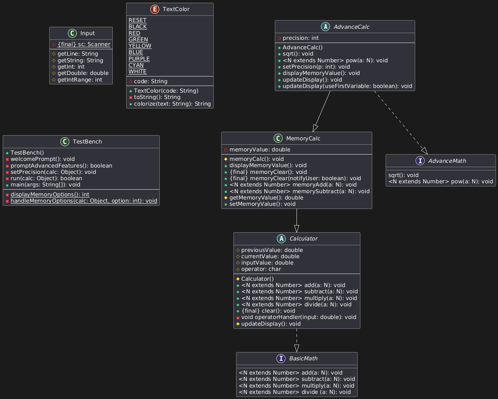
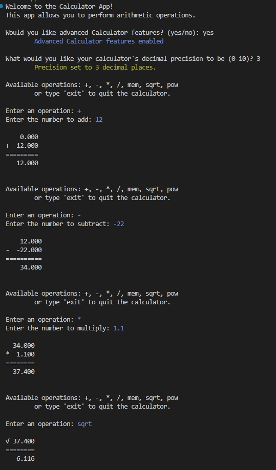
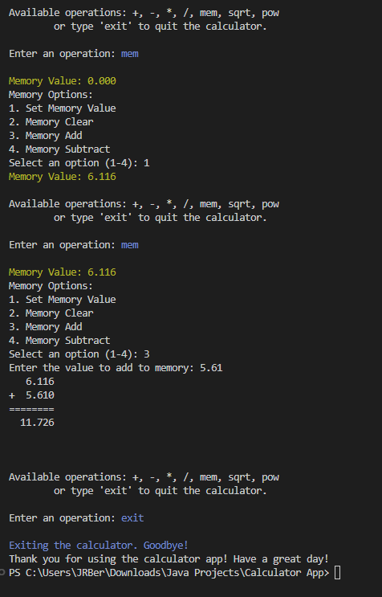

## Calculator App

This Java-based Calculator App is a console application designed to allow users to do calculations of basic and advanced types. This project serves as practice for using Java classes while emphasizing:
- Abstraction
- Interfaces
- Generics
- Enums

Administrators can:
- Select a calculator with basic or advanced features
- Do basic operations (+,-,x,/)
- Do advanced operations (^, sqrt)
- Manage and store a memory variable

<br> 

## 📌 Table of Contents

- [App Preview](#app-preview)
- [Features](#features)
- [Installation](#installation)
- [Usage](#usage)
- [Contributing](#contributing)
- [License](#license)
- [Helpful Resources](#helpful-resources)
- [Top Contributors](#top-contributors)

## App Preview
<br>
<br>
<br>
[View Output](output.txt)

<br>

## 🚀 Key Features

### 🧮 Basic Arithmetic Operations
- Perform standard operations: addition, subtraction, multiplication, and division
- Input validation ensures correct numeric entries
- Intuitive console prompts for seamless operation

### 📐 Advanced Mathematical Features
- Execute advanced calculations such as:
  - Square roots of input values
  - Exponentiation using custom powers
- Adjustable precision settings for controlling decimal output
- Dynamically updates operation history and results

### 💾 Memory Functionality
- Store and recall numeric values using memory features
- Modify memory with add, subtract, clear, and set commands
- Display memory values with colorized, precision-aware formatting

### 📝 Data Validation
- Validates input ranges for precision and menu selection
- Gracefully handles invalid or non-numeric user input
- Type-safe handling of arithmetic operations using Java generics

### 🖥️ Interactive Console UI
- Step-by-step prompts guide the user through available operations
- Differentiates between basic and advanced modes
- Clean output formatting using ANSI colors for better readability

### 🔒 Security & Reliability
- Defensive programming to catch and report runtime errors
- Strict encapsulation of calculator logic and state
- Modular design following OOP principles for easy maintenance and extensibility

<p align="right">(<a href="#readme-top">back to top</a>)</p>

## Installation

To install and run this project locally, follow these steps:

1. Clone the repository:
    ```sh
    git clone https://github.com/JRBerger123/calculator-app.git
    ```
2. Navigate to the project directory:
    ```sh
    cd calculator-app
    ```
3. Compile the Java source files:
    ```sh
    javac src/*.java -d bin
    ```
4. Run the application:
    ```sh
    java -cp bin TestBench
    ```

<p align="right">(<a href="#readme-top">back to top</a>)</p>

## Usage

1. Run the application from your terminal or IDE.
2. Choose whether to use basic or advanced calculator features.
3. Enter an operation when prompted:
    
    - **Basic Mode**
        - `add` or `+` — Add numbers  
        - `subtract` or `-` — Subtract numbers  
        - `multiply` or `*` — Multiply numbers  
        - `divide` or `/` — Divide numbers  

    - **Advanced Mode**
        - `sqrt` — Square root  
        - `pow` — Raise to a power  
        - `mem` — Access memory options  
4. (Advanced Mode) Set the desired decimal precision for output.
5. For memory operations, choose from:
    
    - Set Memory Value  
    - Memory Clear  
    - Memory Add  
    - Memory Subtract  

6. Enter `exit` to close the application at any time.
7. View color-coded output and formatted results after each operation.


<p align="right">(<a href="#readme-top">back to top</a>)</p>

## Contributing

Contributions are what make the open-source community such an amazing place to learn, inspire, and create. Any contributions you make are **greatly appreciated**.

If you have a suggestion that would make this better, please fork the repo and create a pull request. You can also simply open an issue with the tag "enhancement".
Don't forget to give the project a star! Thanks again!

1. Fork the Project
2. Create your Feature Branch (`git checkout -b feature/AmazingFeature`)
3. Commit your Changes (`git commit -m 'Add some AmazingFeature'`)
4. Push to the Branch (`git push origin feature/AmazingFeature`)
5. Open a Pull Request

<p align="right">(<a href="#readme-top">back to top</a>)</p>

## License

Distributed under the MIT License. See `LICENSE` for more information.

## Helpful Resources

How to use README Markdown:<br>
- https://github.com/adam-p/markdown-here/wiki/markdown-cheatsheet<br>
- https://docs.github.com/en/get-started/writing-on-github/getting-started-with-writing-and-formatting-on-github/basic-writing-and-formatting-syntax<br>

Helpful resources for README Template Examples:
- https://github.com/othneildrew/Best-README-Template<br>
- https://gist.github.com/DomPizzie/7a5ff55ffa9081f2de27c315f5018afc<br>
- https://gist.github.com/noperator/4eba8fae61a23dc6cb1fa8fbb9122d45<br>

<p align="right">(<a href="#readme-top">back to top</a>)</p>

## Top Contributors

<a href="https://github.com/JRBerger123/Calculator-App/graphs/contributors">
  
</a>

<p align="right">(<a href="#readme-top">back to top</a>)</p>